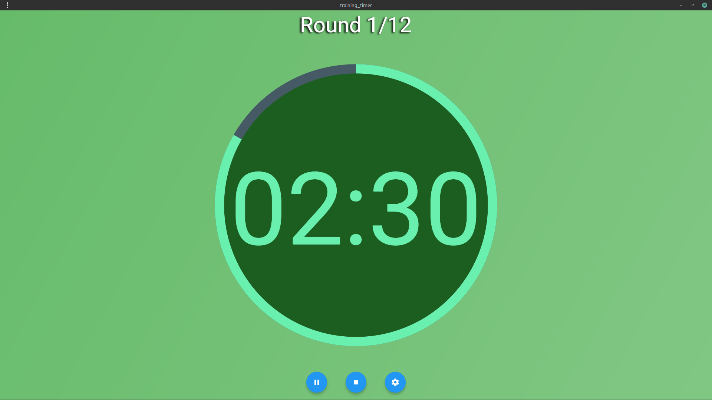

# Training Timer

Training Timer is a customizable workout timer application built with Flutter. It helps you manage your workout and rest intervals with ease, featuring visual progress indicators and audio alerts to keep you on track. This app is designed to be intuitive and user-friendly, suitable for any type of interval training.

## Features

- **Customizable Rounds and Intervals**: Set your desired workout duration, number of rounds, and rest periods.
- **Visual Progress Indicators**: Displays a circular progress indicator for both workout and rest periods.
- **Audio Alerts**: Plays different sounds to signal the start of a round, a warning when 10 seconds remain, and the end of a round.
- **Pause and Resume**: Easily pause and resume your training sessions.
- **Settings Dialog**: Modify your workout settings on the go.

## Screenshots




## Installation

To run this project locally, ensure you have Flutter installed. Then follow these steps:

1. **Clone the repository**:
    ```sh
    git clone https://github.com/plinkr/training-timer.git
    cd training-timer
    ```

2. **Install dependencies**:
    ```sh
    flutter pub get
    ```

3. **Run the app**:
    ```sh
    flutter run
    ```

### Running on the Web

To build and run the web version, follow these steps:

1. **Build the web app**:
    ```sh
    flutter build web --release
    ```

2. **Serve the web app**:
    ```sh
    python -m http.server 1337
    ```

3. **View the web app**:
    Open your web browser and navigate to `http://<your-ip>:1337`, replacing `<your-ip>` with your actual IP address.

## Usage

- Press the **Start** button to begin the timer.
- The timer will automatically switch between workout and rest intervals.
- The **Pause** button allows you to pause the timer, and the **Stop** button will reset it.
- Use the **Settings** button to customize your workout parameters.

## Contributing

Contributions are welcome! Please fork the repository and submit a pull request for any feature additions or bug fixes.

## License

This project is licensed under the MIT License. See the [LICENSE](LICENSE) file for details.

